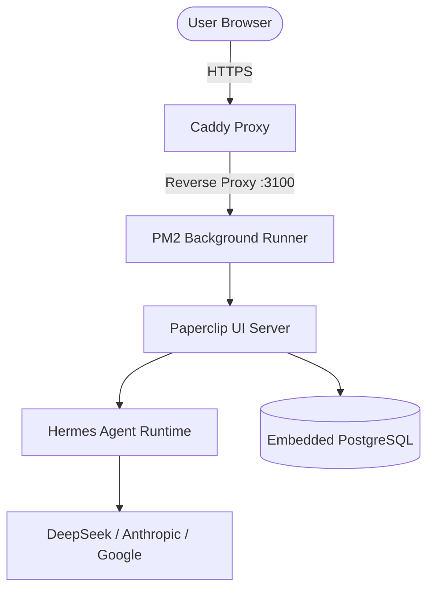

<p align="center">
  
  
  
  
  
</p>

<h1 align="center">⚡ DeepStack (PaperStack)</h1>
<p align="center"><strong>One command. Full AI company infrastructure on any VPS.</strong></p>
<p align="center">
  <em>Paperclip + Hermes Agent + DeepSeek + PM2 + Caddy (Auto-HTTPS) deployed in 60 seconds.</em>
</p>

---

## 🚀 Quick Install

Run this single command on your VPS (Ubuntu/Debian recommended) as `root`:

```bash
curl -fsSL https://raw.githubusercontent.com/yeaminlabs/paperstack/main/install.sh | bash
```

To install non-interactively, pass environment variables:

```bash
export SKIP_INSTALL=true  # Skips interactive prompts (uses defaults)
export CUSTOM_DOMAIN=office.yourdomain.com
export PROVIDER=deepseek
export API_KEY=sk-your-deepseek-key
export EMAIL=admin@yourdomain.com

curl -fsSL https://raw.githubusercontent.com/yeaminlabs/paperstack/main/install.sh | bash
```

## 📦 What Gets Installed?

DeepStack automatically provisions a production-ready environment:
- **Paperclip**: The core AI company orchestration platform UI (running on Port `3100`).
- **Hermes Agent**: Multi-provider AI agent framework (installed via `pipx` for the `paperclip` user).
- **PM2**: Background process manager ensuring Paperclip runs 24/7 and restarts on crash/reboot.
- **Caddy**: Reverse proxy that handles Let's Encrypt SSL certificates automatically.
- **DeepStack CLI**: A powerful unified command-line tool (`deepstack`) to manage everything.

## 🛠️ The `deepstack` CLI

Once installed, the `deepstack` command is globally available. 

| Command | Description |
|---------|-------------|
| `deepstack start` | Start the PM2 background server |
| `deepstack stop` | Stop the server |
| `deepstack restart` | Restart the server safely |
| `deepstack logs` | View live server logs (useful for debugging) |
| `deepstack status` | Check server status and PM2 info |
| `deepstack domain <domain>` | Auto-configure Caddy to route a custom domain with Let's Encrypt SSL |
| `deepstack update` | Update Paperclip, Hermes, and the CLI from GitHub |
| `deepstack fix` | Run automated DeepStack fixes (e.g. permission resets, PM2 syncs) |
| `deepstack doctor` | Run diagnostics |
| `deepstack ui` | Open the web UI (if running locally on macOS/Linux) |

## 🌐 Setting Up a Custom Domain (HTTPS)

DeepStack includes Caddy to automatically handle routing and SSL certificates for you. 

1. Go to your DNS provider (Cloudflare, Namecheap, Route53, etc.).
2. Create an **A Record** pointing your domain (e.g., `office.yourdomain.com`) to your VPS IP address.
3. Wait a few minutes for DNS to propagate.
4. Run the domain setup command:

```bash
deepstack domain office.yourdomain.com
```

This will automatically configure Caddy, fetch an SSL certificate from Let's Encrypt, authorize the hostname in Paperclip's database, and restart the server. Your UI will instantly be available securely at `https://office.yourdomain.com`.

## 🤖 Configuring DeepSeek (or other models)

By default, Paperclip's "CEO" agent might explicitly request Claude/Anthropic. If you are using DeepSeek and get a `No Anthropic credentials found` error, you must change the model in the UI:

1. Log into your Paperclip dashboard.
2. Click **CEO** under the "AGENTS" section on the left sidebar.
3. Under the **Permissions & Configuration** section, find the **Model** dropdown (it usually defaults to "Default").
4. Click the dropdown and select **Use manual model** at the very bottom.
5. In the text box that appears, type your provider/model string exactly. For DeepSeek, use:
   - `deepseek/deepseek-chat` (or `deepseek/deepseek-v4-flash` depending on API availability)
   - `deepseek/deepseek-coder`
6. Go back to your Runs and click **Retry**.

*(DeepStack automatically configures Hermes with your DeepSeek API key during installation under `custom_providers`).*

## 🚑 Troubleshooting

**1. "Requested port is busy; using next free port" / HTTP ERROR 502**
If you see a 502 Bad Gateway on your domain, it usually means an orphaned Node process is holding port 3100 hostage, forcing PM2 to start on 3101 (where Caddy isn't looking). 
**Fix:**
```bash
pm2 stop deepstack
sudo pkill -f paperclipai
sudo pkill -f node
deepstack start
```

**2. "No company access" / Board Claim Required**
If you sign in but see a black screen saying you have no company access, you need to claim the admin board. 
**Fix:**
Run `deepstack logs`. Look for a line that says `Sign in with a real user and open this one-time URL to claim ownership: http://localhost:3100/board-claim/...`. Copy that URL, replace `http://localhost:3100` with your custom domain (`https://office.yourdomain.com`), and visit it in your browser.

**3. "EACCES: permission denied" when starting Hermes**
If a task fails immediately saying Hermes couldn't spawn due to `EACCES`, the `paperclip` user has broken symlinks or missing executable permissions for the Hermes binaries. 
**Fix:**
*(This has been patched in the latest installer, but for older installs, run:)*
```bash
sudo su - paperclip -c "rm -f ~/.local/bin/hermes ~/.local/bin/hermes-agent ~/.local/bin/hermes-acp && pipx install hermes-agent --force"
```

## 🏗️ Architecture



## 📜 License

MIT License

<p align="center">
  <sub>Built with 🧠 by <a href="https://github.com/yeaminlabs">yeaminlabs</a></sub>
</p>
